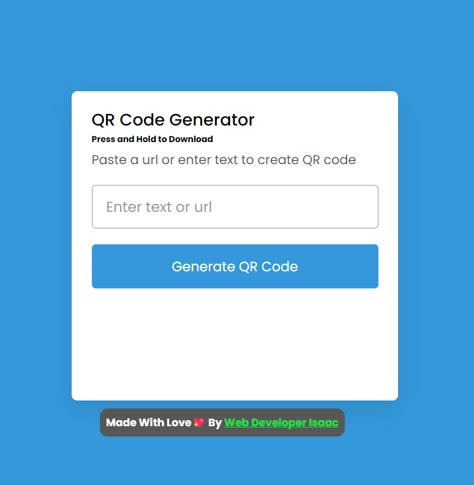

### QR-Code-Generator

Basically the Qr Code Generator Web Applicaton takes in input of any given text or Url and Converts into the QR Code Format

##Pure JavaScript and Simple CSS Side Project

##This Project is OpenSource SO Feel Free to Contribute

Website Deployment : https://qr-code-generator-free.netlify.app/

github pages Deployment : https://webdeveloperisaac.github.io/Qr-Code-Generator/

Initial UI
 

 
After Load:
 

##It Uses the QR-Generator-API and Feeds in the Image Asyncronously
Link : https://www.qr-code-generator.com

Support me on Patreon  

Always Open to Connect : https://webdevisaac.com
